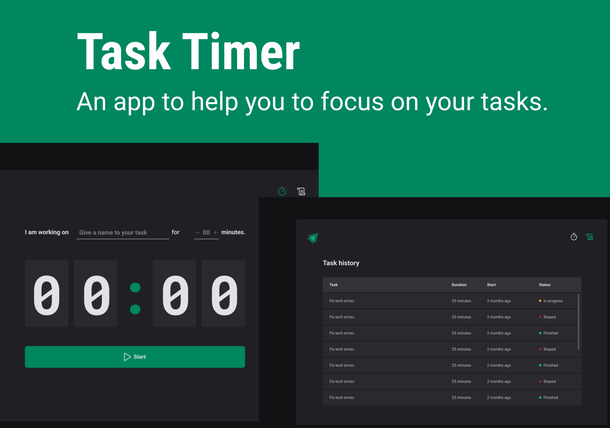

<h1 align="center">
    
</h1>

<br>

## 🧪 Technologies

This project was developed using the following technologies:

- [Vite.js](https://vitejs.dev/)
- [TypeScript](https://www.typescriptlang.org/)
- [React](https://react.dev/)
- [React Hooks: Context | Reducer | State | Effect](https://react.dev/reference/react)
- [Styled Components](https://styled-components.com/)

## 📚 Libraries

This project was developed using the following technologies:

- Routing - [react-router-dom](https://reactrouter.com/)
- Form - [react-hook-form](https://react-hook-form.com/)
- Typescript form validation - [zod](https://zod.dev/)
- Date formatting - [data-fns](https://date-fns.org/)
- Icons - [phorphor-react](https://phosphoricons.com/)
- Immutable state - [immer](https://github.com/immerjs/immer)

## 🚀 Getting Started

Clone the project and navigate to the project folder.

```bash
$ https://github.com/laizeferraz/TaskTimer.git
$ cd TaskTimer
```

To run the development server: 
```bash
# Install the dependencies
$ npm install

# Run the project
$ npm run dev
```
The app runs on the browser in the URL http://localhost:5173.

## 💻 Project

Task Timer is perfect for students and/or profissionais that need to organize their time to focus on their tasks. Type the name of the task, define how long you will focus on it and see the history of your focus time to have a good understand of your productivity and time management. 

This is a project developed as part of the Ignite ReactJS course offered by [Rocketseat](https://www.rocketseat.com.br/) in July 2023. 

## 🔖 Layout

You can see the layout on Figma through the link bellow:

- [Layout Web](https://www.figma.com/file/6iTXEFHmLSb2ZpLJ9PXp3O/Task-Timer?type=design&t=TfI13eX1UvescI8O-6) 

Note: You need to have an account on [Figma](http://figma.com/) to access the link above.

